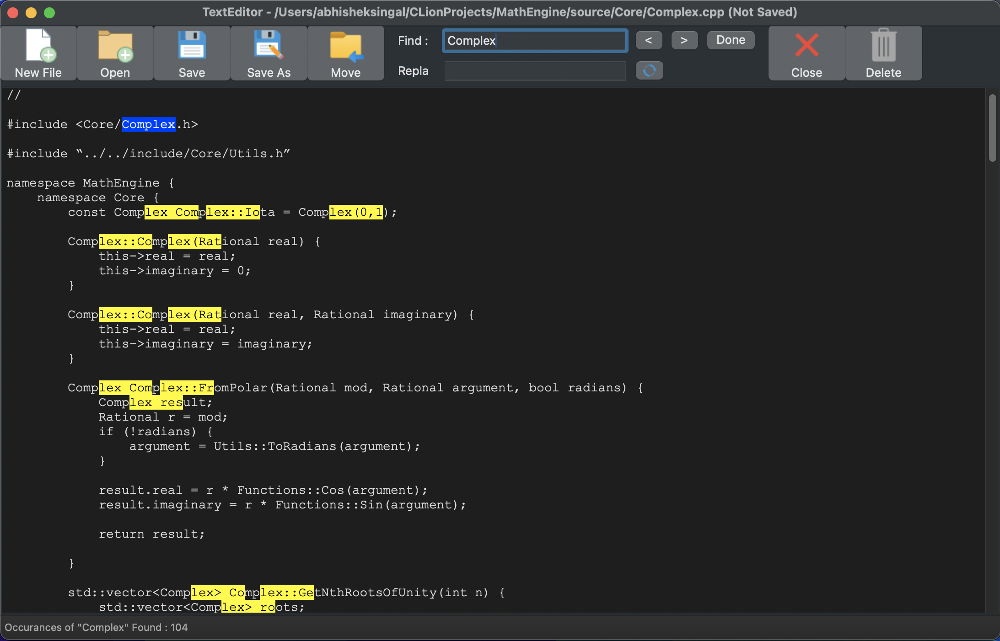
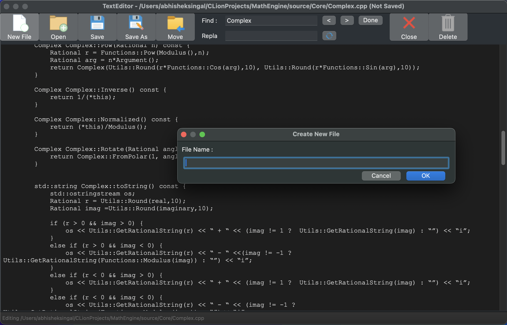

# 📝 WxWidgets Text Editor

> A modern, feature-rich desktop text editor built in **C++** using **WxWidgets**.  
> Designed to demonstrate GUI development, event-driven programming, and desktop application design.

---

## 🖼️ Screenshots

  


---

## 🚀 Features

- ✏️ **Text Editing**: Create, open, edit, and save text files.  
- 📄 **File Management**: Support for new, open, save, and save-as functionality.  
- 🔄 **Undo/Redo**: Step back and forward through editing changes.  
- 📋 **Clipboard Operations**: Copy, cut, and paste text.  
- 🎨 **Customizable GUI**: Clean and responsive interface using WxWidgets.  
- 💻 **Cross-Platform**: Runs on Windows, macOS, and Linux.  

---

## ⚙️ Tech Stack

- **Language:** C++  
- **Framework:** WxWidgets  
- **Design Paradigm:** Event-driven GUI programming  

---

## 🧩 Development Overview

This project demonstrates the **full lifecycle of a desktop application**, from GUI design to handling user input events and implementing core text editor features. The editor emphasizes **clean code architecture** and **modular design**, making it easily extensible for future features like syntax highlighting or plugins.

---

## 📦 Installation / Running

1. Clone the repository:
```bash
git clone https://github.com/<your-username>/WxWidgetsTextEditor.git
